<div align="center">

<a href="https://github.com/ishandutta2007/Awesome-Sustainability-Management">
  
</a>

# 🌱 Awesome Sustainability Management 🌍

**A curated index of top SaaS enterprise platforms, open-source carbon accounting engines, ESG reporting toolkits, Scope 1-3 calculation libraries, and green software frameworks.**

<p align="center">
  <a href="https://github.com/ishandutta2007/Awesome-Awesome-Awesome"></a>
  <a href="https://discord.gg/jc4xtF58Ve"></a>
  <a href="https://github.com/ishandutta2007/Awesome-Sustainability-Management/stargazers"></a>
  <a href="https://github.com/ishandutta2007/Awesome-Sustainability-Management/forks"></a>
  <a href="https://github.com/ishandutta2007/Awesome-Sustainability-Management/blob/main/LICENSE"></a>
  <a href="https://github.com/ishandutta2007/Awesome-Sustainability-Management/pulls"></a>
  <a href="https://github.com/ishandutta2007"></a>
</p>

*Focused on ESG Reporting, Carbon Accounting, Climate Disclosure, EHS Integration, CSRD / ISSB Compliance & Sustainability Data Management*

**📅 Last updated: August 2026**

</div>

---

## 📌 Overview

This repository is a comprehensive, community-maintained directory tracking notable **Enterprise SaaS platforms** and **open-source repositories** for **Sustainability Management**, **Corporate ESG**, and **Climate Action**. 

These tools empower organizations, sustainability officers, developers, and researchers to measure, analyze, and report environmental, social, and governance metrics — including:
- 🌿 **Greenhouse Gas (GHG) Inventories**: Scopes 1, 2, and 3 accounting.
- 📋 **Regulatory Disclosures & Frameworks**: CSRD (ESRS), ISSB, SEC Climate Disclosures, GRI, CDP, TCFD, and SBTi.
- ⚡ **Green Software & Cloud FinOps**: Measuring energy consumption, carbon intensity, and software emissions.
- 🏭 **Life Cycle Assessment (LCA) & EHS**: Multi-site environmental compliance and supply chain stewardship.

---

## 📑 Table of Contents

- [🏢 SaaS & Hosted Platforms](#-saas--hosted-platforms)
- [💻 Open-Source GitHub Projects](#-open-source-github-projects)
- [🧩 Architecture & custom Sustainability Systems](#-architectural-patterns-for-custom-systems)
- [🏷️ SEO & Sustainability Taxonomy](#-seo--sustainability-taxonomy)
- [📈 Star History](#-star-history)
- [🤝 How to Contribute](#-how-to-contribute)
- [⚖️ Disclaimer](#️-disclaimer)

---

## 🏢 SaaS & Hosted Platforms

The table below lists industry-leading commercial sustainability management and ESG disclosure suites, sorted by **Company Size / Valuation** (descending).

| 🏢 Platform | 📝 Description | 📊 Company Size (Revenue / Valuation) | 💵 Pricing (Starting Tier) | 🎁 Free Tier / Free Trial Limits |
| :--- | :--- | :--- | :--- | :--- |
| **[IBM Envizi](https://www.ibm.com/products/envizi)** | ESG data and analytics suite strong in consolidating energy, emissions, and sustainability metrics across multi-site enterprises. | **$222B Market Cap** (IBM parent) / $67.5B annual revenue | Starts at $30,000/year (Essentials tier up to 1,000 Accounts via AWS Marketplace) | **14-day free trial** with full access to core dashboards, reporting modules, and Excel Emissions Calculations add-in (no permanent free tier). |
| **[Intelex](https://www.intelex.com/)** | EHS and sustainability management system supporting environmental compliance, incident management, and sustainability performance tracking. | **$25B Market Cap** (Fortive parent) / Intelex acquired for $570M | Starts at $44–$49/user/month (Safety Essentials tier; min. 25 users billed annually at ~$13,200/year) | **30-day free trial** with full platform feature access and dashboards (no credit card required; no permanent free tier). |
| **[Enablon](https://www.enablon.com/)** | Integrated EHS, sustainability, and risk management platform used by large organizations for operational and corporate sustainability data. | **€18B+ (~$20B) Market Cap** (Wolters Kluwer parent) / €6.1B annual revenue | Starts at ~$25,000–$50,000/year (annual subscription scaled by user seats and site modules) | **Free trial only by request**: 30-day scoped pilot / POC environment available upon enterprise consultation; no permanent free tier. |
| **[Workiva](https://www.workiva.com/)** | Connected reporting and compliance platform widely used for ESG and sustainability disclosures alongside financial reporting. | **$4.07B Market Cap** (NYSE: WK) / $885M annual revenue | Starts at ~$25,000–$40,000/year (unlimited users tier model; typical enterprise contracts ~$36,000–$60,000/year) | **Free trial only by request**: Scoped sandbox / proof-of-concept environment available following live sales consultation; no permanent free tier. |
| **[FigBytes](https://figbytes.com/)** | Sustainability and ESG management platform focused on data collection, performance tracking, and disclosure readiness. | **$1.5B+ Valuation** (AMCS Group parent) / FigBytes division ~$30M–$50M valuation | Starts at ~$20,000–$45,000/year (annual subscription based on module count and active entities) | **Free trial only by request**: Tailored scoping evaluation session and interactive demo available on request; no permanent free tier. |
| **[Sphera](https://sphera.com/)** | Enterprise sustainability, EHS, and LCA platform with deep capabilities for industrial companies, product stewardship, and supply-chain environmental impact. | **$1.4B Valuation** (Blackstone acquisition) / ~$150M+ ARR | Starts at ~$40,000/year for enterprise EHS suite (or €164–€329/user/year for BOMcheck tier) | **45-day free trial** for *Sphera LCA for Experts* (full Life Cycle Assessment modeling); enterprise EHS is demo-only (no permanent free tier). |
| **[Persefoni](https://www.persefoni.com/)** | Climate management and carbon accounting platform emphasizing financial-grade emissions data, particularly strong for financed emissions and PCAF-aligned reporting. | **~$1.0B Valuation** (Climate tech unicorn; $150M+ venture funding) | Free ($0) for Persefoni Pro; Advanced tier starts at ~$25,000/year | **Free Forever**: Persefoni Pro plan includes unlimited Scope 1, 2, and 3 footprint calculations, self-guided SMB disclosure, and no credit card required. |
| **[Diligent ESG](https://www.diligent.com/)** | ESG and sustainability reporting capabilities within the broader Diligent governance platform, aimed at board-level and regulatory disclosure. | **$1.0B+ Valuation** (Acquired for $624M by Insight Partners; $330M+ ARR) | Starts at ~$5,000/feature/year (average GRC/ESG deployment starts at ~$23,800/year) | **14-day free trial / pilot** available through sales consultation; no permanent free tier. |
| **[Cority](https://www.cority.com/)** | EHS and sustainability cloud that connects operational environmental data with corporate ESG reporting and compliance workflows. | **$1.0B Valuation** (Thoma Bravo majority investment; ~$100M+ ARR) | Starts at ~$15,000–$50,000/year (~£20,000/instance/year for specialized cloud modules) | **Free trial only by request**: Guided sandbox evaluation and demo environment available via sales consultation; no permanent free tier. |
| **[Novisto](https://novisto.com/)** | ESG data management and reporting platform designed to streamline collection, calculation, and disclosure across frameworks. | **~$80M–$120M Valuation** (Series B funded; $30M+ venture funding) | Starts at ~CAD $40,000/year (~USD $29,500/year annual subscription) | **Free trial only by request**: Live guided evaluation session and demo environment available on request; no permanent free tier. |

---

## 💻 Open-Source GitHub Projects

Curated collection of open-source sustainability frameworks, carbon emission calculation libraries, grid carbon APIs, and climate data tools — sorted by **GitHub Stars** (descending).

| 📦 Project & Repository | 🌟 Github_Stars | 📖 Description | 🛠️ Tech Stack / Domain |
| :--- | :--- | :--- | :--- |
| **[Electricity Maps](https://github.com/electricitymaps/electricitymaps-contrib)** | [](https://github.com/electricitymaps/electricitymaps-contrib/stargazers) | Real-time 24/7 visualization and data pipeline for electricity CO₂ intensity and origin across global grids. | Python, TypeScript, Geodata |
| **[Scaphandre](https://github.com/hubblo-org/scaphandre)** | [](https://github.com/hubblo-org/scaphandre/stargazers) | Electrical power consumption and energy metric agent for bare-metal, virtual machines, Kubernetes, and cloud servers. | Rust, Prometheus, Metrics |
| **[CodeCarbon](https://github.com/mlco2/codecarbon)** | [](https://github.com/mlco2/codecarbon/stargazers) | Lightweight Python package that tracks and estimates carbon emissions produced by running computing workloads and AI/ML pipelines. | Python, AI/ML, Emissions |
| **[Cloud Carbon Footprint](https://github.com/cloud-carbon-footprint/cloud-carbon-footprint)** | [](https://github.com/cloud-carbon-footprint/cloud-carbon-footprint/stargazers) | Comprehensive tool to measure, analyze, and reduce cloud carbon emissions and energy consumption across AWS, Azure, and Google Cloud Platform. | TypeScript, React, Cloud FinOps |
| **[Carbon Aware SDK](https://github.com/Green-Software-Foundation/carbon-aware-sdk)** | [](https://github.com/Green-Software-Foundation/carbon-aware-sdk/stargazers) | WebAPI and CLI tool from the Green Software Foundation to help applications run when renewable energy is cleanest on the grid. | C#, .NET, Web API |
| **[CO2.js](https://github.com/thegreenwebfoundation/co2.js)** | [](https://github.com/thegreenwebfoundation/co2.js/stargazers) | JavaScript library by The Green Web Foundation to calculate the carbon emissions produced by user browsing, websites, apps, and data transfer. | JavaScript, Node.js, Web |
| **[CarbonTracker](https://github.com/lfwa/carbontracker)** | [](https://github.com/lfwa/carbontracker/stargazers) | Package for tracking, predicting, and benchmarking energy consumption and carbon emissions of deep learning model training. | Python, PyTorch, TensorFlow |
| **[Software Carbon Intensity (SCI) Spec](https://github.com/Green-Software-Foundation/sci)** | [](https://github.com/Green-Software-Foundation/sci/stargazers) | Specification to calculate a standardized rate of carbon emissions for software systems, accounting for operational and embodied carbon. | Standards, Specification |
| **[Green Metrics Tool](https://github.com/green-coding-solutions/green-metrics-tool)** | [](https://github.com/green-coding-solutions/green-metrics-tool/stargazers) | Benchmarking software to measure energy consumption and carbon emissions of applications with detailed timelines and dashboards. | Python, Docker, Energy Profiling |
| **[PowerAPI](https://github.com/powerapi-ng/powerapi)** | [](https://github.com/powerapi-ng/powerapi/stargazers) | Modular software-defined power meter library capable of estimating process-level power consumption in real-time. | Python, Linux, Power Monitoring |
| **[pymrio](https://github.com/konstantinstadler/pymrio)** | [](https://github.com/konstantinstadler/pymrio/stargazers) | Multi-Regional Input-Output (MRIO) analysis tool for parsing environmental databases (EXIOBASE, WIOD, Eora) and computing supply-chain footprints. | Python, MRIO, Supply Chain LCA |
| **[Blockchain Carbon Accounting](https://github.com/hyperledger-labs/blockchain-carbon-accounting)** | [](https://github.com/hyperledger-labs/blockchain-carbon-accounting/stargazers) | Hyperledger Labs project implementing auditable emissions calculations, carbon credit tracking, and decentralized climate claim verification. | TypeScript, Solidity, Hyperledger |
| **[ecoCode](https://github.com/green-code-initiative/ecoCode)** | [](https://github.com/green-code-initiative/ecoCode/stargazers) | Open-source SonarQube plugin detecting energy-greedy code smells and carbon inefficiencies across multiple programming languages. | Java, SonarQube, Clean Code |
| **[physrisk](https://github.com/os-climate/physrisk)** | [](https://github.com/os-climate/physrisk/stargazers) | OS-Climate engine for calculating asset-level physical climate risk (flood, extreme heat, coastal inundation) for sustainable finance. | Python, Climate Risk, Finance |
| **[Odoo Sustainability Modules](https://github.com/sustainability-suite/sustainability-odoo)** | [](https://github.com/sustainability-suite/sustainability-odoo/stargazers) | Suite of Odoo ERP modules for tracking Scope 1/2/3 CO₂-equivalent emissions, emission factors, and CSRD reporting directly within ERP workflows. | Python, Odoo, ERP Accounting |
| **[Implied Temperature Rise (ITR)](https://github.com/os-climate/itr)** | [](https://github.com/os-climate/itr/stargazers) | OS-Climate model and calculation engine for determining portfolio alignment with temperature goals (e.g. 1.5°C or 2°C Paris targets). | Python, Sustainable Finance |

---

## 🧩 Architectural Patterns for Custom Systems

Organizations building internal sustainability intelligence systems often combine modular open-source building blocks:

```
                               ┌────────────────────────┐
                               │  Activity Data Sources │
                               │ (ERP, Utility, Cloud)  │
                               └───────────┬────────────┘
                                           │
                                           ▼
┌─────────────────────────────────────────────────────────────────────────────────┐
│                           Emissions Calculation Layer                            │
│  ┌───────────────────────┐  ┌───────────────────────┐  ┌───────────────────────┐│
│  │   CodeCarbon / PowerAPI │  │     pymrio (MRIO)     │  │  Carbon Aware SDK     ││
│  │   (Compute Emissions)   │  │   (Scope 3 & LCA)     │  │  (Grid Intensity)    ││
│  └───────────────────────┘  └───────────────────────┘  └───────────────────────┘│
└──────────────────────────────────────────┬──────────────────────────────────────┘
                                           │
                                           ▼
                               ┌────────────────────────┐
                               │ Storage & Auditing     │
                               │ (PostgreSQL / Ledger)  │
                               └───────────┬────────────┘
                                           │
                                           ▼
                               ┌────────────────────────┐
                               │ ESG Disclosure Engine  │
                               │ (CSRD, ISSB, CDP, GRI) │
                               └────────────────────────┘
```

1. **Emission Factor Engines**: Ingest raw activity data (kWh, travel km, fuel liters, cloud compute seconds) and pair with standardized databases (DEFRA, EPA eGRID, IPCC, EXIOBASE).
2. **Cloud & Software Measurement**: Use **CodeCarbon**, **Cloud Carbon Footprint**, and **Scaphandre** for real-time monitoring of IT digital footprints.
3. **ERP & Ledger Integration**: Store immutable, audit-ready emission logs in transactional databases or ERP extensions (e.g., **Odoo Sustainability Modules**).
4. **Disclosure & Visualization**: Map final metrics against European Sustainability Reporting Standards (ESRS), ISSB, and SEC disclosures using BI tools (Superset, Metabase) or reporting templates.

---

## 🏷️ SEO & Sustainability Taxonomy

This repository covers key concepts and standards in modern climate software engineering and corporate sustainability:

- **Carbon Accounting**: Scope 1 (Direct), Scope 2 (Indirect - Electricity/Heating), Scope 3 (Value Chain & Financed Emissions under PCAF).
- **ESG Regulatory Compliance**: Corporate Sustainability Due Diligence Directive (CSDDD), Corporate Sustainability Reporting Directive (CSRD / ESRS), SEC Climate-Related Disclosures, EU Taxonomy, ISSB (IFRS S1 & S2).
- **Green Computing & FinOps**: Software Carbon Intensity (SCI), Embodied Carbon, Energy-Aware Scheduling, Cloud Carbon Optimization.
- **Reporting Standards**: Global Reporting Initiative (GRI), Carbon Disclosure Project (CDP), Task Force on Climate-related Financial Disclosures (TCFD), Science Based Targets initiative (SBTi).

---

## 📈 Star History

[](https://star-history.dera.page/#ishandutta2007/Awesome-Sustainability-Management&type=date&legend=top-left)

---

## 🤝 How to Contribute

Contributions, updates, and new platform additions are warmly welcome!

1. 🍴 **Fork the repository**.
2. 🌿 **Create a feature branch** (`git checkout -b feature/add-new-tool`).
3. 📝 **Add your entry** in [README.md](file:///C:/Users/ishan/Documents/Projects/Awesome-Sustainability-Management/README.md) following the existing tabular format and criteria (include name, verified pricing / free limits, and star counts).
4. 🚀 **Submit a Pull Request** with a brief summary of the added tool and official references.

⭐️ **Star this repo** if you find it helpful for your sustainability and carbon accounting initiatives!

---

## ⚖️ Disclaimer

- This is an **independent, community-curated directory** provided for informational purposes — not a legal, financial, or auditing endorsement.
- Sustainability, carbon accounting, and ESG disclosures entail regulatory, compliance, and financial liability.
- Calculation models, emission factors, and accounting boundaries should always be verified by qualified carbon accounting professionals and accredited assurance providers.

---

<div align="center">

**Made with 💚 for sustainability practitioners, ESG analysts, climate-tech builders, and green software engineers worldwide.**

</div>
